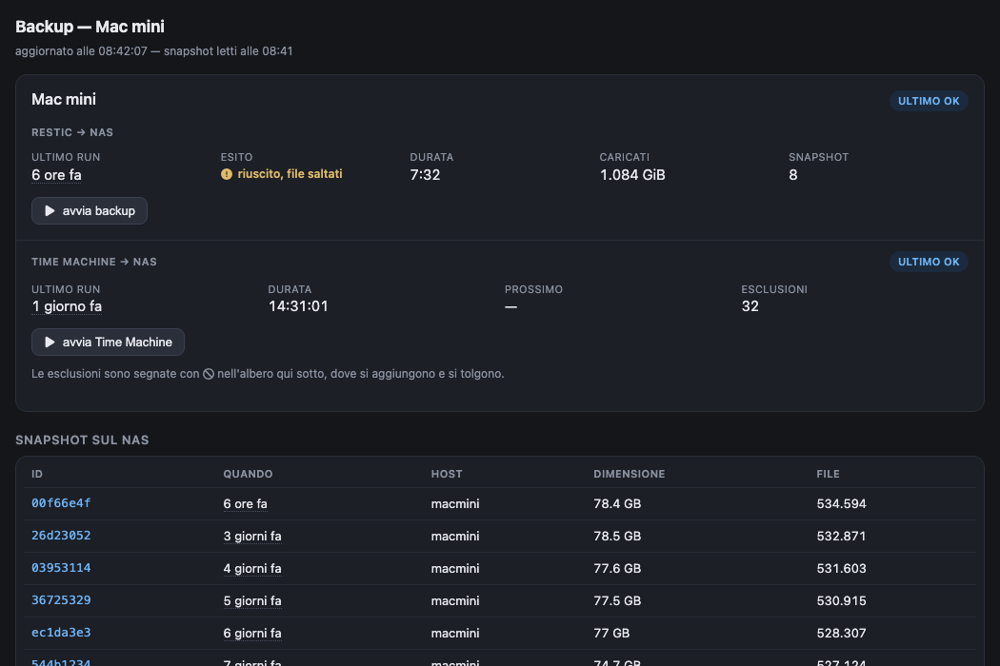

# backup-mac-nas

Backup completo di un Mac verso un NAS via SFTP con [restic](https://restic.net),
affiancato da Time Machine, con un cruscotto web per controllarli entrambi.

Nasce per sostituire Time Machine di rete su un collegamento poco affidabile:
lo sparsebundle di TM su SMB non tollera i cali di connessione e in quei casi
ricomincia da capo, mentre restic riprende a livello di blocco. Time Machine
resta comunque, ridimensionato: utile per rimettere in piedi il sistema in
fretta, mentre restic conserva i dati in modo versionato e compresso.

## Cosa fa

- **Backup notturno con restic** dell'intero disco, cifrato e deduplicato,
  verso una cartella SFTP sul NAS. Con retention configurabile.
- **Cruscotto web** in rete locale: stato dei due backup, storico, snapshot,
  e un albero del disco per verificare se un file è nel backup, ripristinarlo
  o escluderlo da Time Machine.
- **Notifiche push** (via Home Assistant, facoltative) quando un backup
  fallisce e quando torna a funzionare. Silenzio quando va tutto bene.
- **Watchdog**: avvisa se non c'è un backup riuscito da più di 30 ore — copre
  anche il caso in cui il backup non parta affatto.
- **Sblocco automatico** dei lock rimasti sul repository dopo un'interruzione,
  che altrimenti bloccano in silenzio tutti i backup successivi.



## Requisiti

- macOS (testato su Apple Silicon)
- `restic` e `sshpass`:
  ```sh
  brew install restic
  brew install hudochenkov/sshpass/sshpass
  ```
- Un NAS che accetti connessioni SFTP. Non serve la shell: molti NAS la negano
  agli utenti non amministratori ma lasciano attivo il sottosistema SFTP, e a
  restic basta quello.
- Facoltativo: Home Assistant per le notifiche.

## Installazione

```sh
git clone https://github.com/borile91/backup-mac-nas.git
cd backup-mac-nas
./installa.sh
```

L'installer chiede i dati del NAS, scrive la configurazione in
`~/.config/backup-mac-nas/config.env`, inizializza il repository e installa i
job automatici. Si può rilanciare senza fare danni.

Alla fine il cruscotto è su `http://<indirizzo-del-mac>:8787/`.

> **La password di cifratura del repository va conservata altrove.**
> Senza quella, il backup è illeggibile: nemmeno chi ha accesso al NAS può
> recuperare i dati.

## Come è organizzato

| | |
|---|---|
| `bin/backup.sh` | il backup restic vero e proprio, gira come root |
| `bin/watchdog.sh` | controlla che i backup stiano avvenendo |
| `bin/notifica.sh` | manda le notifiche push |
| `bin/tm-backup.sh` | avvia Time Machine e ne registra l'esito |
| `bin/tm-coda-esclusioni.py` | applica le esclusioni TM chieste dal cruscotto |
| `bin/comune.sh` | configurazione condivisa |
| `web/server.py` | il cruscotto (solo libreria standard) |
| `esclusioni.txt` | cosa non salvare |

I job installati:

| quando | cosa | dove |
|---|---|---|
| 03:00 | backup restic | crontab di root |
| ogni minuto | tasto "avvia backup" del cruscotto | crontab di root |
| ogni minuto | coda esclusioni Time Machine | crontab di root |
| 09:00 | watchdog | crontab di root |
| 05:00 | Time Machine | LaunchAgent utente |
| sempre | cruscotto web | LaunchAgent utente |

## Alcune scelte spiegate

**Perché cron e non launchd.** Su macOS l'accesso all'intero disco è protetto
da TCC. `/usr/sbin/cron` ne è esente, mentre un LaunchDaemon che invoca
`/bin/bash` richiederebbe di autorizzare `bash` a mano nelle impostazioni di
sistema. Con cron il backup legge tutto senza passaggi manuali.

**Perché il cruscotto non applica da solo le esclusioni.** `tmutil addexclusion`
pretende l'Accesso completo al disco e **sudo non basta**: fallisce con lo
stesso errore anche da root. Il cruscotto quindi scrive la richiesta in una
coda e una riga di crontab (che è esente) la esegue entro un minuto.

**Perché i lock vanno rimossi a mano.** Se la connessione cade mentre restic
tiene il lock, quel lock resta sul NAS. restic lo considera "morto" solo se il
processo che lo ha creato non esiste più, ma su una macchina accesa da
settimane quel numero di processo viene riciclato e il lock sembra ancora vivo:
i backup successivi falliscono tutti, in silenzio. Qui, se non c'è nessun
restic in esecuzione, i lock presenti sono per forza orfani e vengono rimossi.

**File su iCloud.** I file di iCloud Drive non scaricati in locale sono
segnaposto e non si possono leggere: restic li segnala con
`resource deadlock avoided`. Sono esclusi di proposito — stanno già nel cloud.
Se Desktop e Documenti sono sincronizzati con iCloud, vale anche per loro.

## Sicurezza

- La configurazione contiene la password del NAS in chiaro: sta fuori dal
  repository, in `~/.config/backup-mac-nas/config.env` con permessi `600`.
- **Il cruscotto non ha autenticazione** e permette di sfogliare e ripristinare
  file: va tenuto in rete locale, mai esposto su internet.

## Licenza

[MIT](LICENSE). Le icone del cruscotto sono
[Font Awesome Free](https://fontawesome.com/license/free) (CC BY 4.0).
